# PRD — 产品需求文档

| 属性 | 值 |
|:---|:---|
| 文档版本 | v1.0 |
| 最后更新 | 2026-06-14 |

---

## 1. 项目概述

**DocMind** — 企业内部知识库智能问答平台。员工用自然语言提问，系统从文档中语义检索，由 LLM 生成可溯源的答案。

核心价值：**你不必知道文档在哪、叫什么名字、关键词是什么，问就行。**

### 1.1 原型设计
本项目用 Python 生态重新实现核心设计。
主要原型图：
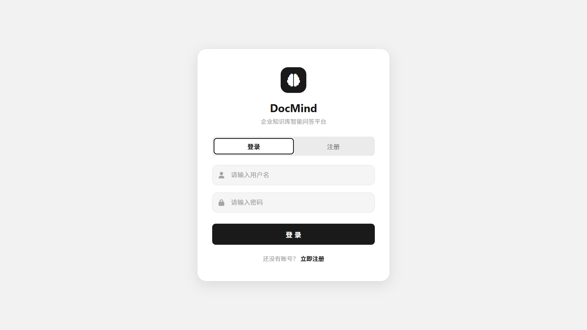

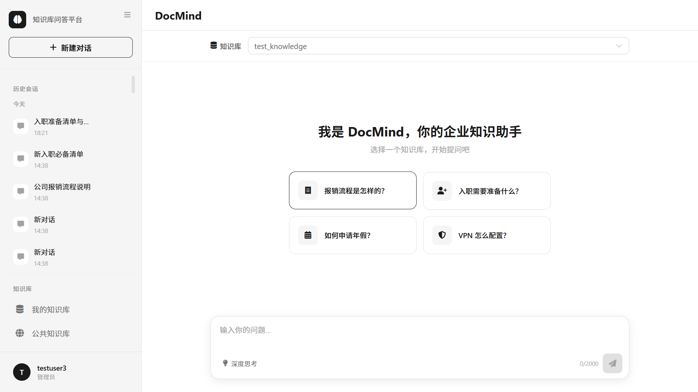
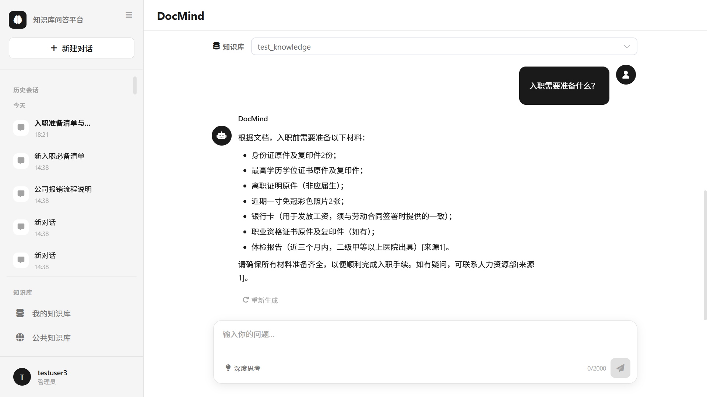
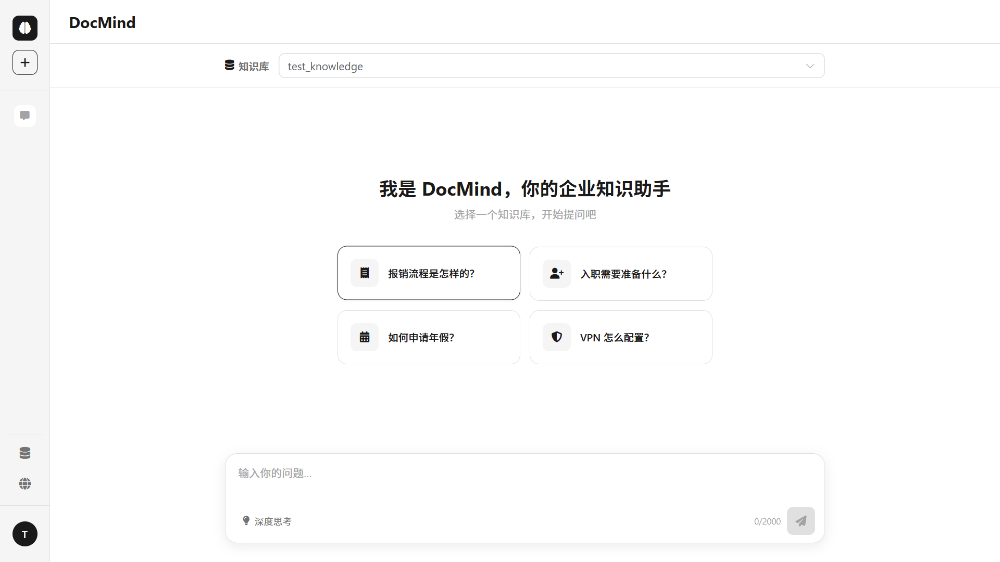
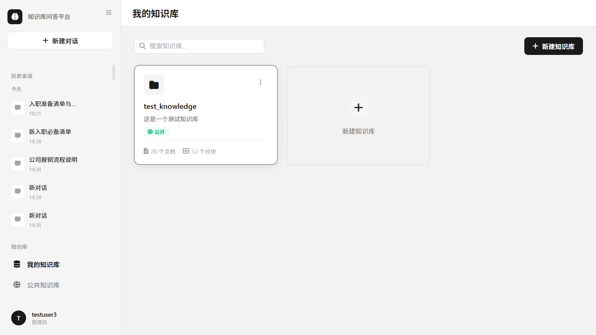
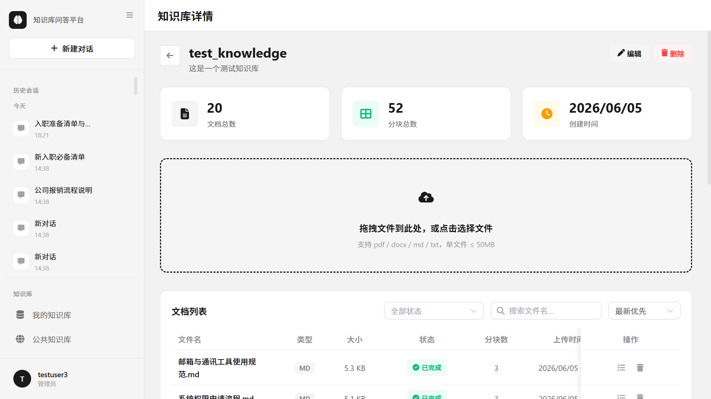
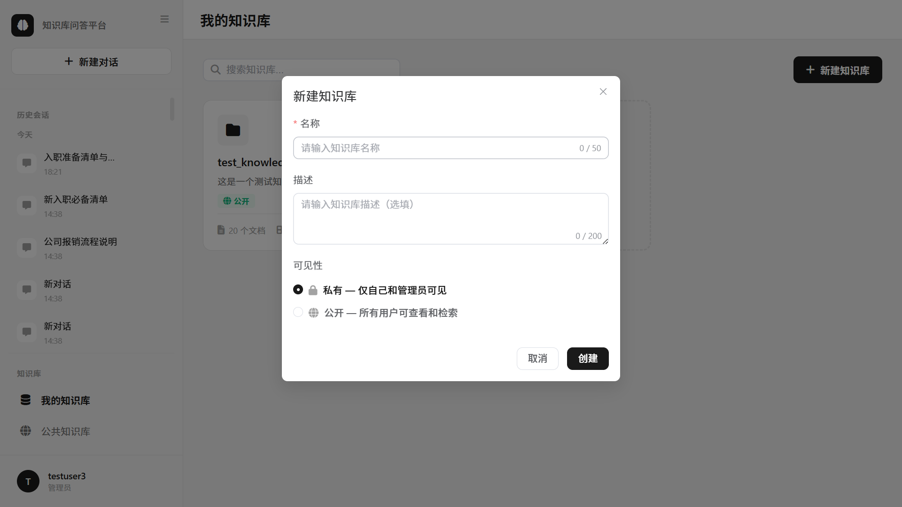
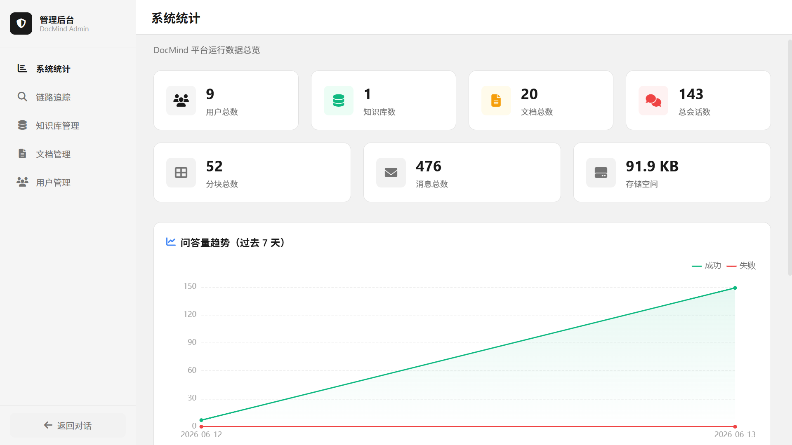
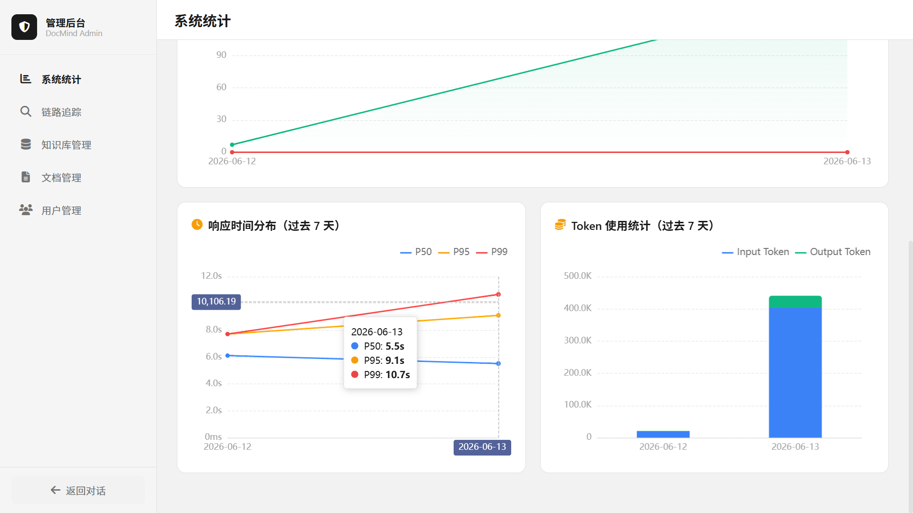
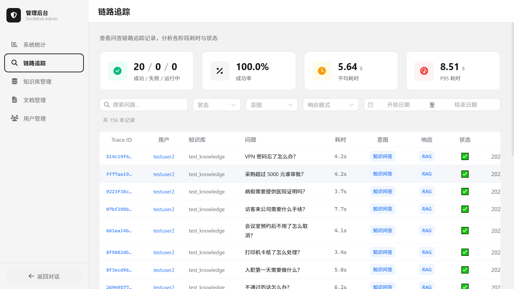
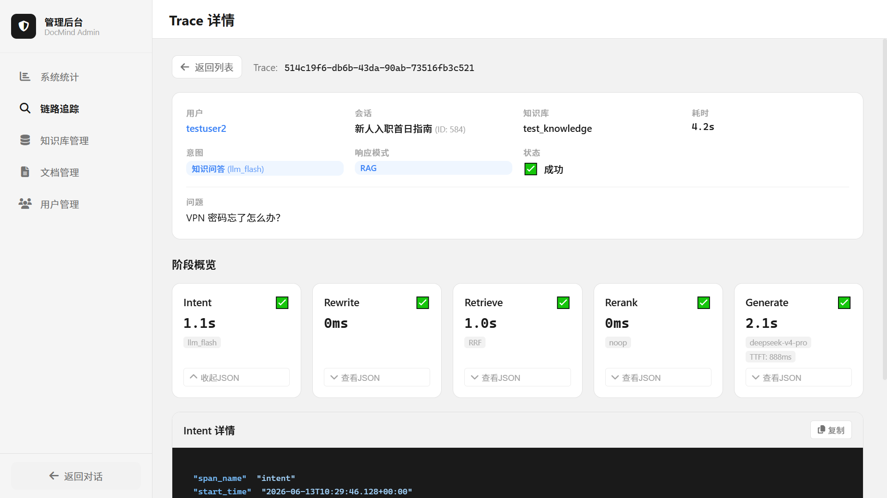
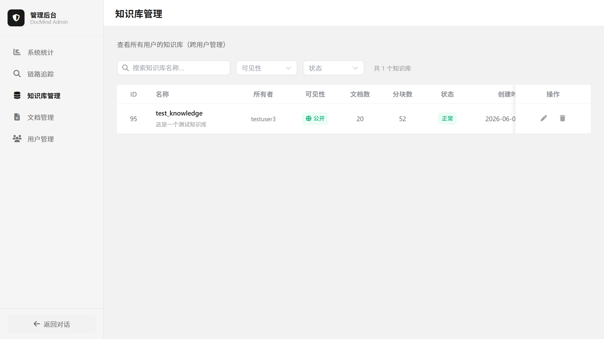
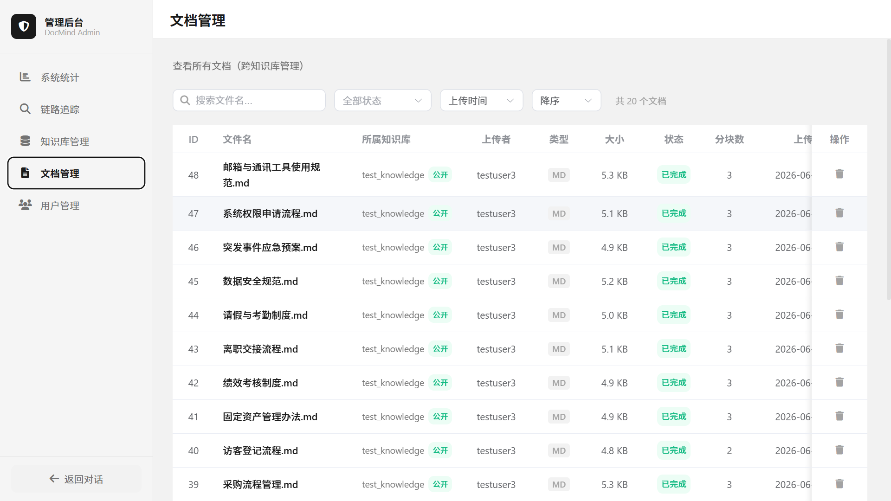
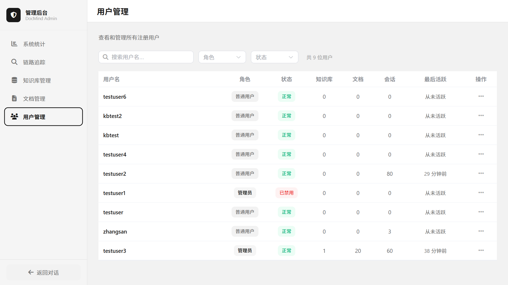
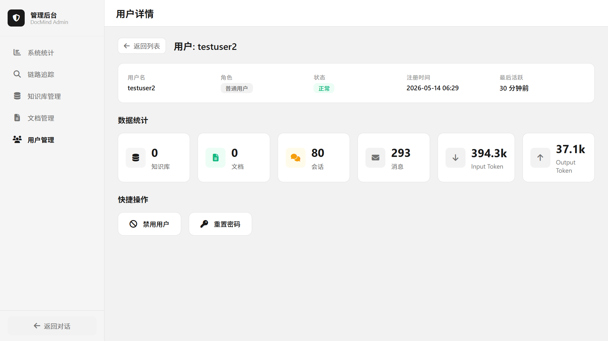

---

## 2. 业务背景与痛点

**场景：中型互联网公司（300+ 员工，6 个部门）的"信息孤岛"问题。**

公司日常运转依赖大量制度文档和业务规范，散落在各个角落：

| 部门 | 文档类型 |
|:---|:---|
| HR | 入职指南、薪资福利、报销流程、请假制度、招聘 SOP |
| IT | VPN 配置、打印机使用说明、系统权限申请、故障排查 |
| 行政 | 会议室预约、访客登记、办公用品申领 |
| 业务 | 接口文档、数据安全规范、合规检查清单 |
| 财务 | 开票信息、采购审批制度 |

**4 大核心痛点：**

1. **新人入职成本高** — 新员工面对海量 Wiki 不知道从哪看起，"报销打车费要填什么表"需翻 5-10 分钟文档或反复问 HR
2. **文档检索效率低** — 全文搜索只做关键词匹配。搜"墨盒怎么换"匹配不到"打印机耗材更换步骤"，搜"加班调休"漏掉"弹性工作制与补休规则"
3. **跨部门知识获取困难** — 技术查报销规则要翻财务文档，运营查安全规范要翻合规文档，找不到或版本已过时
4. **重复问答消耗人力** — HR 和 IT 支持人员每天回答大量重复问题，答案明明写在文档里

---

## 3. 典型使用场景

| 角色 | 场景 | 传统方式 | DocMind |
|:---|:---|:---|:---|
| 新入职员工 | "报销差旅费需要提交哪些材料？" | 翻 Wiki 10 分钟，或问 HR 等回复 | 输入问题，5 秒得到答案并附源文档 |
| 技术开发 | "生产环境数据库密码怎么申请？" | 不知道找哪个文档，问了一圈人 | 检索 IT 规范文档，直接定位申请流程 |
| HR | "2025 年的年假政策相比去年有什么变化？" | 翻历史版本文档对比 | 自动检索相关段落并对比 |
| 运维 | "服务器安全基线检查有哪些项目？" | 翻安全规范 PDF 逐条看 | 自然语言提问，按检查项返回 |

---

## 4. 目标用户

| 角色 | 权限级别 | 核心需求 |
|:---|:---|:---|
| 普通员工 | user | 提问获取答案，查看引用源文档 |
| 知识库管理员 | admin | 管理知识库、上传文档、查看入库状态、查看使用统计 |

> [Planned: Phase 6] 用户画像 Persona — 建议包含 2-3 个典型角色的详细画像（姓名、部门、技术熟练度、使用频率、核心目标）。当前目标用户表（§4）已覆盖基本角色定义，Persona 细化不阻塞上线。

---

## 5. 知识库可见性模型

### 5.1 设计原则

采用「弱混合模式」：`visibility` 控制 READ（谁能看），`ownership` 控制 WRITE（谁能改），admin 拥有管理级 WRITE 覆盖（可删除/修正元数据，但不上传文档）。

- 不走「仅 admin 能建 KB」的极端——任意用户都能创建知识库
- 不走「完整多租户/协作权限」的极端——不做 shared/ACL 表
- 一个字段解决问题：`visibility: private | public`
- admin 不是「只读管理」——admin 能看一切（含 private KB）、能删 KB/文档（违规清理）、能修正 KB 元数据（不当名称/离职员工 KB 转 public），但不能替别人上传文档

**实现层**：权限规则由 `app/core/permissions.py` 的三个共享函数统一执行——`require_kb_readable`（visibility 优先）、`require_kb_writable`（ownership 基础）、`require_kb_owner`（owner-only 写操作）。所有 KB 接口和 service 层统一调用，禁止各模块分散实现权限检查。

### 5.2 所有权归属规则（ownership）

| 场景 | 规则 |
|:---|:---|
| 创建知识库 | 创建者自动成为 owner（`user_id` = 当前用户） |
| 所有权转移 | 不支持。KB 一经创建，owner 不可变更 |
| 用户注销 | `ON DELETE RESTRICT`，必须先由 admin 手动删除其 KB 才能注销用户 |

### 5.3 可见性规则（visibility）

| 属性 | 值 | 说明 |
|:---|:---|:---|
| 类型 | `ENUM('private', 'public')` | 默认 `'private'` |
| `private` | 仅 owner 可见、可管理 | admin 可查看/审计/删除/修正元数据 |
| `public` | 所有登录用户可查看、可问答 | admin 可查看/审计/删除/修正元数据 |

### 5.4 CRUD 权限矩阵

> **实现说明**：权限检查由 `app/core/permissions.py` 的共享函数统一执行（`require_kb_readable`/`require_kb_writable`/`require_kb_owner`），所有 KB 接口和 service 层均通过这三个函数校验，不自行实现权限逻辑。

| 操作 | owner (private) | owner (public) | 其他用户 (private) | 其他用户 (public) | admin |
|:---|:---|:---|:---|:---|:---|
| 创建 KB | ✅ | ✅ | ✅ | ✅ | ✅ |
| 查看 KB 详情 | ✅ | ✅ | ❌ | ✅ | ✅（含 private KB 审计） |
| 查看 KB 列表 | ✅（自己的） | ✅（自己的） | ❌（不可见） | ✅（公开列表可见） | ✅（全局列表，含 private） |
| 编辑 KB 元数据 | ✅ | ✅ | ❌ | ❌ | ✅（名称/描述/visibility 修正） |
| 删除 KB | ✅ | ✅ | ❌ | ❌ | ✅（违规清理） |
| 上传文档 | ✅ | ✅ | ❌ | ❌ | ❌（不越权写入） |
| 删除文档 | ✅ | ✅ | ❌ | ❌ | ✅（逐文档违规清理） |
| 查看文档列表 | ✅ | ✅ | ❌ | ✅（只读，不含分块） | ✅（审计 private KB 内容） |
| 查看文档分块 | ✅ | ✅ | ❌ | ❌ | ✅（审计 private KB 内容） |
| 问答检索 | ✅ | ✅ | ❌ | ✅ | ✅（全部 KB） |

### 5.5 问答检索范围

> **实现说明**：检索管线由 `app/rag/knowledge_pipeline.py`（KnowledgePipeline）实现，封装查询重写→双路检索→RRF→Rerank→句子匹配→Prompt 构建全流程。`chat_service.py` 委托 KnowledgePipeline 完成检索+上下文构建，自身专注于 LLM SSE 流式输出。

| 用户角色 | `POST /api/chat` 可检索的 KB |
|:---|:---|
| user | 自己拥有的所有 KB + 所有 `visibility=public` 的 KB |
| admin | 所有 KB |

> **约束**：`POST /api/chat` 的 `kb_id` 参数必须指向用户有权检索的 KB（own KB 或 public KB），通过 `require_kb_readable()` 校验。对 private KB 且非 owner，返回 E5005「无权限执行此操作」。

### 5.6 暂时不做的

| 推迟项 | 原因 |
|:---|:---|
| shared（指定用户共享） | 需要 ACL 表 + 邀请机制 + 权限传递，复杂度爆炸 |
| 部门管理员 / 角色扩展 | 当前无真实需求，PRD 仅有 user/admin 两种角色 |
| 协作编辑、版本控制 | 那是 Notion，不是知识库问答平台 |

---

## 6. 验收标准

| 指标 | 目标值 | 实际值（Phase 3/4） | 说明 | 来源 |
|:---|:---|:---|:---|:---|
| 检索 Recall@5 | ≥ 0.85 | **1.000**（28/28 完全召回） | 向量+BM25 RRF 融合后的 top-5 召回率 | ROADMAP §5.5 / tests/TESTING.md §5 |
| 检索 MRR | ≥ 0.70 | — | 平均倒数排名（压测时补充） | tests/TESTING.md §5 |
| 检索 Precision@5 | ≥ 0.60 | — | top-5 精确率（压测时补充） | tests/TESTING.md §5 |
| 端到端 P50 延迟 | ≤ 3s | — | 50% 的问答在 3 秒内完成（压测时补充） | ROADMAP §7.1 / tests/TESTING.md §7.3 |
| 端到端 P99 延迟 | ≤ 10s | — | 99% 的问答在 10 秒内完成（压测时补充） | tests/TESTING.md §7.3 |
| 答案综合评分 | ≥ 4.0/5.0 | **第 1 轮 4.38** / **第 2 轮 4.76** | 准确性(40%)+完整性(30%)+溯源(20%)+表达(10%)，两轮均达标 | ROADMAP §5.5 / §6.6 |
| 文档入库成功率 | ≥ 99% | ✅ 已实现（部分容错分级：<20% warning / 20-50% partial / >50% failed） | 不含格式不支持的预期失败 | PRD 原始需求 |
| 并发用户数 | ≥ 10 | — | 峰值负载下系统不降级（Phase 5 压测验证） | tests/TESTING.md §7.3 |
| 回归测试通过率 | 100% | **✅ 100%**（后端 649 + 前端 220 全部通过） | 每次提交运行全量回归 | ROADMAP §5.5 / §6.6 |

---

## 7. 相关文档

- [架构设计文档](ARCHITECTURE.md)
- [数据库设计文档](../backend/docs/DATABASE.md)
- [接口文档](../backend/docs/API.md)
- [开发指南](DEVELOPMENT.md)
- [开发排期](ROADMAP.md)
- [测试策略](tests/TESTING.md)
- [UI 设计规范](../frontend/docs/UIDESIGN.md)
